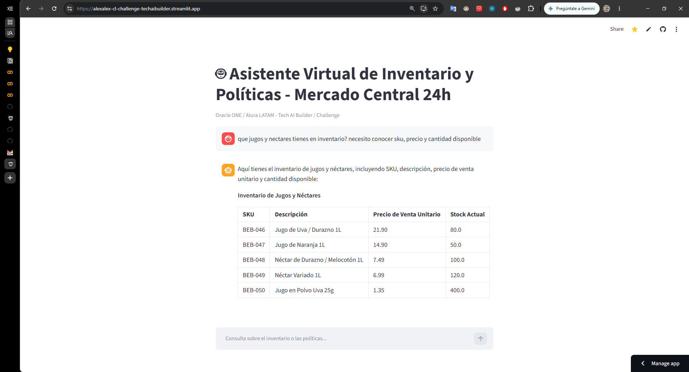

# 🛒 Asistente Inteligente de Inventario y Políticas - Supermercado LATAM
> **Challenge Tech AI Builder - Oracle ONE / Alura LATAM**

Una aplicación web interactiva impulsada por Inteligencia Artificial (**Google Gemini API**) que permite consultar dinámicamente el estado del inventario de un supermercado (datos estructurados CSV) y las políticas operativas/comerciales de la empresa (documentos PDF no estructurados).

---

### 🌐 Aplicación en Producción
👉 **Accede a la App Desplegada:** [Asistente Supermercado LATAM](https://alexalex-cl-challenge-techaibuilder.streamlit.app/)

---

## Evidencia de Funcionamiento


---

## 📌 Características Principales

* **Consulta de Inventario en Tiempo Real (CSV):** Análisis dinámico del archivo `inventario_de_supermercado_latam.csv` para verificar stock, precios, fechas de vencimiento, categorías y estado de productos.
* **Procesamiento de Políticas (RAG / PDFs):** Lectura e integración de 4 documentos PDF con políticas internas de devolución, promociones, almacenamiento y atención al cliente.
* **Procesamiento de Lenguaje Natural (PLN):** Respuestas precisas y contextualmente relevantes generadas por el modelo **Gemini 1.5 / 2.0**.
* **Interfaz Web Intuitiva:** Desarrollada con **Streamlit** para ofrecer una experiencia fluida e interactiva en la nube.
* **Despliegue Continuo:** Alojamientos e integración continua a través de **Streamlit Community Cloud**.

---

## 🛠️ Tecnologías Utilizadas

* **Lenguaje:** Python 3.10+
* **Interfaz Web:** Streamlit
* **Modelo LLM / AI:** Google Gemini API (`google-generativeai`)
* **Procesamiento de Datos:** Pandas
* **Lectura de PDFs:** PyPDF2 / pdfplumber
* **Gestión de Entorno:** `python-dotenv`
* **Control de Versiones y Despliegue:** Git, GitHub, Streamlit Cloud

---

## 📂 Estructura del Repositorio

```text
├── .gitignore                                 # Archivos ignorados por Git (.env, venv, etc.)
├── README.md                                  # Documentación del proyecto
├── app.py                                     # Código principal de la aplicación Streamlit
├── requirements.txt                           # Dependencias de Python necesarias
├── inventario_de_supermercado_latam.csv       # Dataset de productos e inventario
└── politicas/                                 # Carpeta con los 4 archivos PDF de políticas
    ├── Politica_Devoluciones.pdf
    ├── Politica_Promociones.pdf
    ├── Politica_Almacenamiento.pdf
    └── Politica_Atencion_Cliente.pdf

